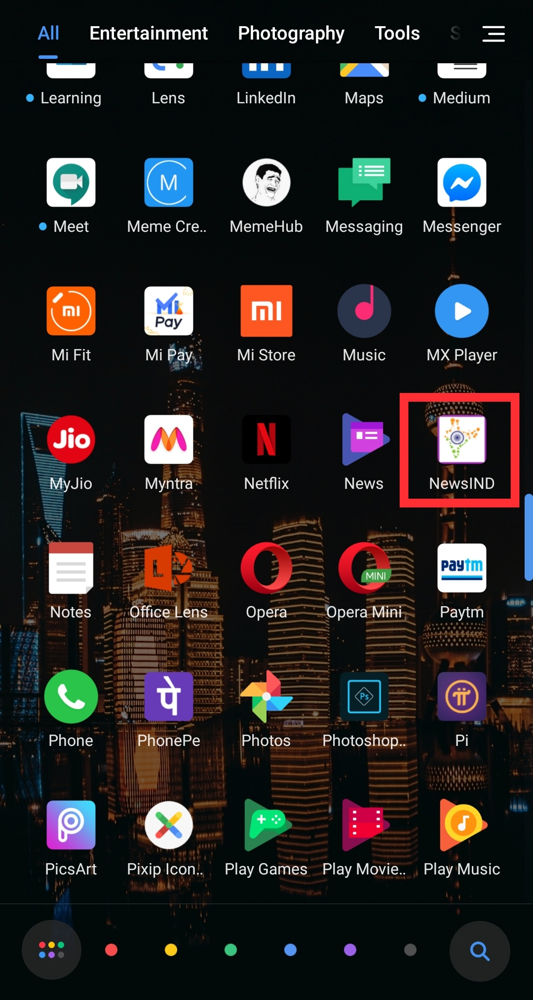

# NewsIND (Android App)
NewsIND is a news feeding Android App with multiple categories of news section build on Android Studio using Kotlin.

NewsIND is created on an empty activity of Android Studio using the official language Kotlin. Here the concepts of intent, recycler view & API call are used. Volley & Glide libraries are also used during the API Call.
Multiple APIs are called here due to different categories of news sections. Chrome Custom Tabs are used to view the full article of a specific news in the app so that the user remains inside the app throughout the uses time.
This is a project based application using APIs from newsapi.org. This app is not published in play store. APIs that are used here are for project based and are not to engage in any commercial purposes.

Some screenshots of this app are attached below.

 
 
 
